# 🛡️ MediGuard Compliance Agent
### Agentic AI Accelerator for Insurance Fraud & Overbilling Detection

> 7-agent forensic workflow that detects insurance fraud, overbilling, price gouging, unbundling, and regulatory violations in hospital claims — grounded in official Indian regulatory and pricing knowledge bases.


> 🔒 **This is a private repository.** Source code is not publicly accessible. This README documents the system architecture, capabilities, and business impact.

---

## 📌 Overview

Insurance fraud and overbilling — ghost hospitals, inflated consumables, medicine price gouging, surgical upcoding, unbundled charges — cost the healthcare ecosystem billions annually. Manual audits are slow, inconsistent, and reactive.

MediGuard Compliance Agent is an **end-to-end agentic AI framework** that orchestrates **7 specialized agents** to audit raw hospital bills against official Indian regulatory, pricing, and clinical knowledge bases. It transforms unstructured hospital bills into structured forensic audit verdicts — with every flag traced back to a specific regulation, price cap, or clinical standard.

Built for insurers, TPAs, fraud investigation units, and regulatory compliance teams.

---

## 💼 Business Problem

| Fraud / Overbilling Pattern | Description |
|---|---|
| **Ghost hospitals** | Unregistered or invalid institutions billing claims |
| **Cross-system fraud** | Ayurvedic centers billing for high-end allopathic surgery |
| **Unauthorized procedures** | Procedures beyond facility's registered specialization |
| **Forced diagnostic testing** | Unnecessary tests inflating bills |
| **Administrative fee inflation** | Overhead charges billed as clinical services |
| **Medicine price gouging** | Unit prices exceeding NPPA government ceiling |
| **Surgical upcoding** | Higher-grade surgery package billed for lower-grade procedure |
| **Unbundling of consumables** | Items included in package billed separately |
| **Systematic over-utilization** | Coverage exhaustion through repeated diagnostics and consultations |

---

## ✅ What MediGuard Does

- **Extracts** itemized billing entries from raw hospital bill PDFs via OCR + multimodal LLM
- **Validates** hospital registration and system-of-medicine authorization
- **Audits** clinical scope — doctor specialization vs facility capabilities vs billed procedures
- **Scans** administrative and consumable charges against IRDAI non-payable lists
- **Compares** medicine unit prices against NPPA government ceiling prices
- **Benchmarks** surgical packages against NHA PM-JAY and GIPSA PPN standards
- **Synthesizes** all flagged patterns into a final fraud risk verdict with actionable recommendations

---

## 🏗️ 7-Agent Forensic Workflow

```mermaid
flowchart TD
    INPUT[🏥 Hospital Bill PDF\nUnstructured · Multi-page · Itemized] --> S1

    S1["🖊️ Step 1 — Digital Scribe\nExtraction & Structuring Agent"]
    S1 --> S1a[OCR + Multimodal LLM]
    S1a --> S1b[Structured Bill JSON\nPatient · Insurer · Itemized Entries · Unit Rates]

    S1b --> S2

    S2["🏛️ Step 2 — Identity Sentinel\nInstitutional Validation Agent"]
    S2 --> S2a[National Health Portal\nHospital Directory]
    S2 --> S2b[Ayurvedic Institution\nDirectory]
    S2a & S2b --> S2c{Ghost Hospital?\nCross-System Fraud?}
    S2c --> R2[Institutional\nValidation Report]

    R2 --> S3

    S3["🩺 Step 3 — Clinical Scope Auditor\nMedical Necessity & Specialization Agent"]
    S3 --> S3a[NHP Specializations\nDatabase]
    S3a --> S3b{Forced Testing?\nUnauthorized Procedure?\nReferral Kickback?}
    S3b --> R3[Clinical\nValidation Report]

    R3 --> S4

    S4["📋 Step 4 — Consumable Auditor\nAdministrative Fraud Agent"]
    S4 --> S4a[IRDAI Non-Payable\nList — Annexure I]
    S4 --> S4b[HDFC Life Non-Payable\nGuidelines]
    S4a & S4b --> S4c{Admin Fee Inflation?\nProhibited Charges?}
    S4c --> R4[Non-Payable Items\nAudit Summary]

    R4 --> S5

    S5["💊 Step 5 — Pharmacy Auditor\nPrice Gouging Detection Agent"]
    S5 --> S5a[NPPA Ceiling\nPrice List]
    S5a --> S5b{Price Cap\nViolations?}
    S5b --> R5[Medicine Price\nCompliance Report]

    R5 --> S6

    S6["⚕️ Step 6 — Surgical Auditor\nProcedure & Package Integrity Agent"]
    S6 --> S6a[NHA PM-JAY\nBenefit Packages]
    S6 --> S6b[GIPSA PPN\nRate Standards]
    S6a & S6b --> S6c{Upcoding?\nUnbundling?}
    S6c --> R6[Package Compliance\n& Rate Benchmarking Report]

    R6 --> S7

    S7["⚖️ Step 7 — Fraud Sentinel\nReasoning & Verdict Agent"]
    S7 --> S7a[IRDAI Fraud\nGuidelines]
    S7a --> S7b[Synthesize All\nFlagged Patterns]
    S7b --> S7c[Systemic Over-utilization\nBehavior Analysis]
    S7c --> VERDICT[📊 Final Fraud Risk\nAssessment & Verdict]

    style S1 fill:#1e2230,stroke:#f5c542,color:#e2e8f0
    style S2 fill:#1e2230,stroke:#2dd4bf,color:#e2e8f0
    style S3 fill:#1e2230,stroke:#60a5fa,color:#e2e8f0
    style S4 fill:#1e2230,stroke:#a78bfa,color:#e2e8f0
    style S5 fill:#1e2230,stroke:#fb7185,color:#e2e8f0
    style S6 fill:#1e2230,stroke:#f97316,color:#e2e8f0
    style S7 fill:#1e2230,stroke:#4ade80,color:#e2e8f0
    style VERDICT fill:#1e2230,stroke:#f5c542,color:#e2e8f0
```



---

## 🧱 Technical Stack

| Layer | Technology |
|---|---|
| **Document Extraction** | OCR + Multimodal LLM (bill parsing) |
| **Agent Orchestration** | LangChain Agents / Custom Multi-Agent Framework |
| **Knowledge Bases** | IRDAI, NPPA, NHA, GIPSA, NHP (structured databases) |
| **Vector Store** | ChromaDB (regulatory document retrieval) |
| **Embeddings** | Sentence-Transformers |
| **Clinical Reasoning** | Rule-based + LLM hybrid |
| **Output Schema** | Pydantic, JSON |
| **API Layer** | FastAPI |
| **Deployment** | On-premise / Private Cloud |

---

## 📚 Regulatory Knowledge Base

Every MediGuard decision is evidence-backed and regulation-aligned:

| Knowledge Base | Purpose |
|---|---|
| **IRDAI Fraud Guidelines** | Policy & legal framework for fraud pattern evaluation |
| **NPPA Ceiling Price List** | Government medicine price caps for gouging detection |
| **IRDAI Non-Payable List (Annexure I)** | Prohibited administrative and consumable charges |
| **HDFC Life Non-Payable Guidelines** | Insurer-specific overhead charge controls |
| **NHA PM-JAY Benefit Packages** | Procedure and surgery package benchmarking |
| **GIPSA PPN Rate Standards** | Network provider rate standards for comparison |
| **National Health Portal — Hospital Directory** | Institution registration and authorization validation |
| **Ayurvedic Institution Registry** | System-of-medicine cross-validation |

---

## 🎯 Agent-by-Agent Capabilities

### 🖊️ Step 1 — Digital Scribe
Converts raw hospital bill PDF into structured machine-readable JSON via OCR and multimodal LLM. Extracts patient details, sponsor/insurer, itemized billing entries, unit rates, and procedure descriptions.

### 🏛️ Step 2 — Identity Sentinel
Validates hospital registration against the National Health Portal directory and Ayurvedic Institution Registry. Detects ghost hospitals and cross-system fraud (e.g., Ayurvedic center billing for surgical procedures).

### 🩺 Step 3 — Clinical Scope Auditor
Maps admitted doctor specialization and facility registered capabilities against billed procedures. Flags forced testing, referral kickback patterns, and procedures outside facility scope.

### 📋 Step 4 — Consumable Auditor
Scans every administrative and consumable line item against IRDAI and insurer non-payable lists. Flags overhead charges incorrectly billed as clinical services (e.g., admission fees, insurance processing charges).

### 💊 Step 5 — Pharmacy Auditor
Compares each medicine's billed unit rate against the NPPA government ceiling price. Flags any item exceeding the legal price cap as a potential price gouging violation.

### ⚕️ Step 6 — Surgical Auditor
Benchmarks the gross bill against NHA PM-JAY package rates and GIPSA PPN standards. Detects surgical upcoding (higher grade billed than performed) and consumable unbundling (package-included items billed separately).

### ⚖️ Step 7 — Fraud Sentinel
Synthesizes all flagged patterns across all agents, evaluates systemic over-utilization behavior (multiple consultations, repeated diagnostics, coverage exhaustion), and generates the final fraud risk verdict aligned with IRDAI guidelines.

---

## 📋 Final Audit Output Structure

```json
{
  "hospital_identity": "VERIFIED",
  "verified_payable_amount": "₹XX,XXX",
  "flagged_overcharges": {
    "amount": "₹2,100",
    "items": [
      "ADMISSION FEE – ₹1,100 (Non-payable per IRDAI Annexure I)",
      "INSURANCE PROCESSING CHARGES – ₹1,000 (Overhead, non-payable)"
    ]
  },
  "potential_violations": [
    "Unbundled Surgical Consumables – ₹10,711.55 (included in NHA package norm)",
    "Medicine Price Cap Violation – [if applicable]"
  ],
  "fraud_risk_score": "Medium",
  "actionable_recommendation": "Dispute administrative processing charges per IRDAI guidelines. Seek justification for consumable unbundling against PM-JAY package inclusion norms.",
  "audit_trail": "Full agent-by-agent findings attached"
}
```

---

## 📊 Business Impact

| KPI | Result |
|---|---|
| Fraud Detection Accuracy | **Significantly improved** |
| Overbilling Recovery | **Increased** |
| Manual Audit Time | **↓ 60–75% reduction** |
| Regulatory Compliance | **Strengthened** |
| Claim Dispute Resolution | **Faster with defensible audit trail** |
| Audit Transparency | **Full agent-level explainability** |

---

## 🔑 Key Differentiators

- **7-agent forensic pipeline** — each agent owns one domain of fraud detection end-to-end
- **Regulatory-grounded** — every flag backed by IRDAI, NPPA, NHA, or GIPSA standard
- **Explainable verdicts** — not just a fraud score, but itemized reasoning per violation
- **Cross-database validation** — hospital registry + clinical scope + pricing + package standards all cross-checked
- **Fraud pattern intelligence** — systemic behavior analysis beyond individual claim review
- **Audit-ready documentation** — structured output suitable for dispute management and regulatory submission

---

## 🚀 Deployment Model

```
┌──────────────────────────────────────────────────┐
│       MediGuard Deployment                       │
│                                                  │
│  ✅ On-Premise / Private Cloud                   │
│  ✅ API-first integration                        │
│  ✅ Docker containerized                         │
│                                                  │
│  Integrations:                                   │
│  → Insurance Claims Management Systems          │
│  → TPA Fraud Investigation Platforms            │
│  → Regulatory Compliance Dashboards             │
│  → Hospital Billing Audit Systems               │
│                                                  │
│  Knowledge Base Updates:                         │
│  → NPPA price lists updated periodically        │
│  → IRDAI guidelines version-controlled          │
│  → NHA package rates refreshable                │
└──────────────────────────────────────────────────┘
```

---

## 🔒 Privacy & IP Notice

This repository contains proprietary source code, multi-agent orchestration logic, and regulatory intelligence pipelines for healthcare fraud detection. The code, models, and agent architecture are **not publicly accessible**.

If you are a recruiter, collaborator, or evaluator and would like a walkthrough or demo, please reach out:

📧 [paularpitaseis@gmail.com](mailto:paularpitaseis@gmail.com)
🔗 [LinkedIn — Arpita Paul](https://www.linkedin.com/in/dr-arpita-paul-575708135/)

---

## 👩‍💻 Author

**Arpita Paul** · Senior Data Scientist · GenAI & LLM Specialist
*From Seismology to GenAI 🚀 | NuSummit | Mumbai*

[](https://github.com/ArpitaAI-collab)
[](https://linkedin.com/in/yourprofile)

